# Manual do Utilizador — LexCV

Bem-vindo ao **LexCV**, a plataforma moderna de gestão para escritórios de advogados e controlo de processos jurídicos. Este manual foi desenhado para ajudar utilizadores de todos os níveis de experiência a navegar e a tirar o máximo partido do sistema de forma rápida e autónoma.

---

## 1. Introdução

O **LexCV** é uma aplicação web centralizada criada para modernizar e simplificar a gestão diária de escritórios jurídicos. Ela funciona como um assistente digital inteligente para advogados, assistentes e gestores de processos.

### Para que serve?

Com o LexCV, pode:

* Criar e organizar a ficha de dados dos seus **Clientes**.
* Acompanhar **Processos Judiciais** desde a fase inicial até à conclusão.
* Gerir a sua **Agenda** (prazos críticos, reuniões, audiências e diligências).
* Organizar e guardar **Documentos** de forma segura, com controlo de acessos e versões.
* Acompanhar o estado **Financeiro** do escritório (honorários faturados, recebidos e em falta).

### Principais Benefícios

1. **Verificação Automática de Conflitos (*Conflict Check*):** Antes de aceitar um caso, o sistema verifica se existe algum conflito de interesses com clientes antigos ou partes contrárias.
2. **Segurança de Informação:** Cada documento tem um nível de privacidade próprio (Público, Interno, Confidencial ou Restrito).
3. **Controlo de Acessos (RBAC):** O administrador define o que cada perfil profissional pode ver ou editar.

---

## 2. Primeiros Passos

### Como aceder e fazer o login

1. Abra o seu navegador de Internet (Google Chrome, Microsoft Edge, Safari ou Firefox).
2. Digite o endereço da aplicação fornecido pelo seu administrador e prima **Enter**.
3. No ecrã de início de sessão, insira o seu **E-mail** e a sua **Palavra-passe**.
4. Clique no botão **Entrar**.

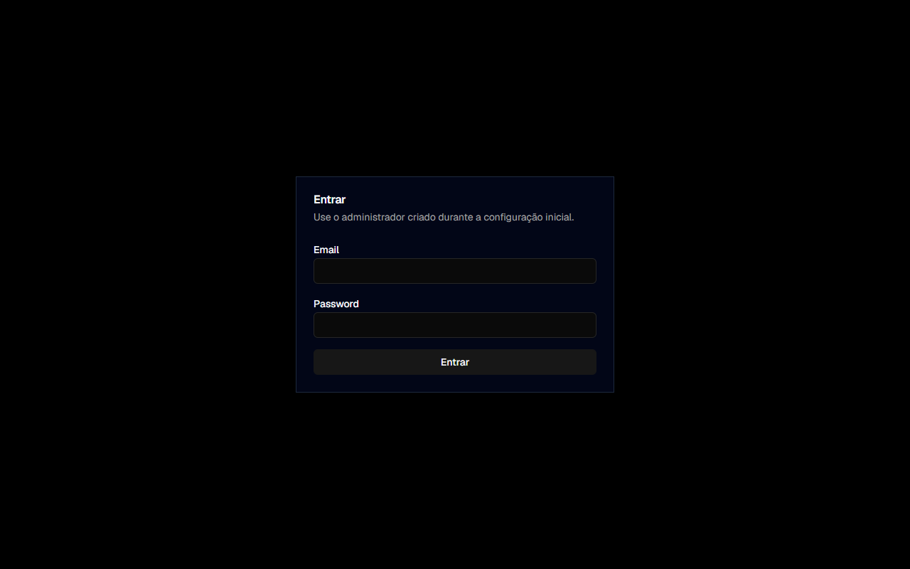

### O Painel Principal (Dashboard)

Após o login, será redirecionado para o **Dashboard** — a central de controlo do sistema, com:

1. **Navegação Lateral (Esquerda):** Acesso a todas as áreas — Clientes, Processos, Agenda, Documentos, Financeiro e Configurações.
2. **Indicadores Financeiros:** Cartões no topo com totais de faturação, valores recebidos e em dívida.
3. **Pesquisa Unificada:** Barra de pesquisa no topo para encontrar qualquer registo rapidamente.
4. **Eventos da Agenda e Processos Recentes:** Visão imediata das atividades mais urgentes.

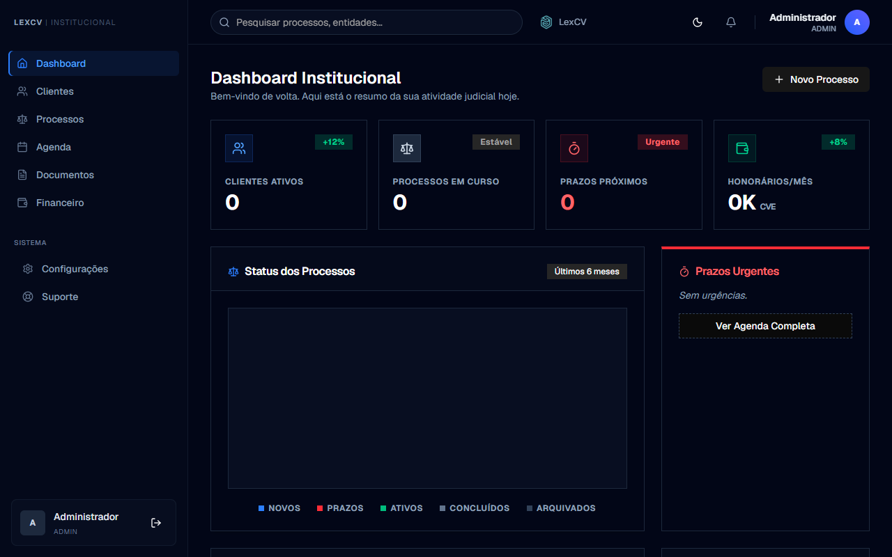

---

## 3. Guias Passo a Passo

### Guia 1: Registar um Novo Cliente

1. No menu lateral esquerdo, clique em **Clientes**.
2. Clique no botão **Novo Cliente** (canto superior direito).

   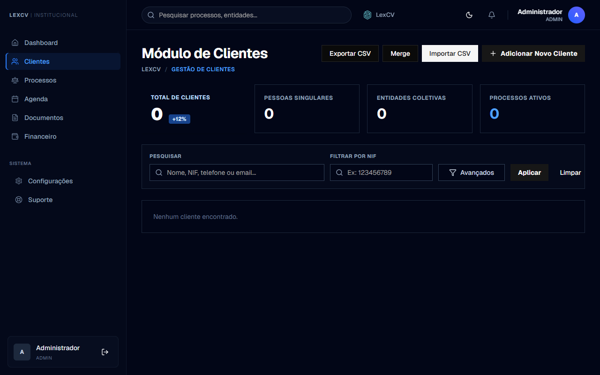

3. Preencha os campos obrigatórios na secção **Dados**:
   * **Nome** — nome completo do cliente ou empresa.
   * **NIF** — Número de Identificação Fiscal.
   * **Tipo** — "Particular" ou "Empresa".
   * **E-mail** e **Telefone** — contactos.
   * **Localidade** e **Morada** — endereço.
4. Na secção **Informações Adicionais**, preencha:
   * **Tipo de Documento** (NIF, CNI ou Passaporte) e respetivo **Número**.
   * **Ramo de Atividade** (Banca, Serviços, Comércio, etc.).
   * **Detalhes Adicionais** — campo de texto livre para notas.
5. Clique em **Criar**.

   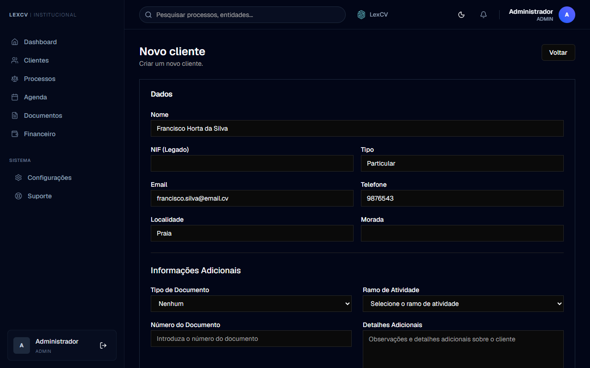

---

### Guia 2: Abrir um Processo com Verificação de Conflitos (3 Etapas)

O registo de um processo segue um assistente guiado (*Wizard*) com 3 etapas obrigatórias.

#### Etapa 1 — Dados de Intake

1. No menu lateral, clique em **Processos** e depois em **Novo Processo**.

   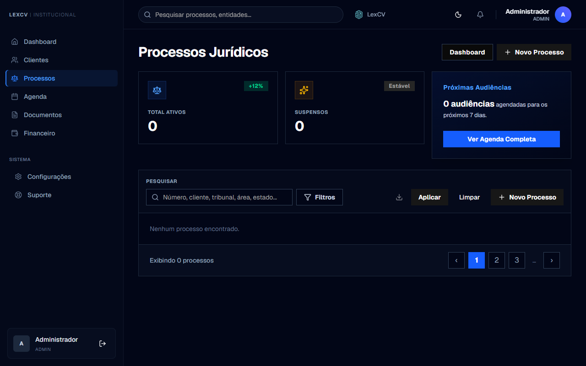

2. Preencha o formulário da Etapa 1:
   * **Cliente** — selecione na lista suspensa.
   * **Tipo de Processo** — Cível, Penal, Laboral, etc.
   * **Número** — ex.: `245/2026`.
   * **Área Jurídica**, **Tribunal**, **Datas de Início e Fim**, **Descrição**.
3. Clique em **Continuar para Conflict Check**. O processo fica em estado **"Em Triagem"**.

   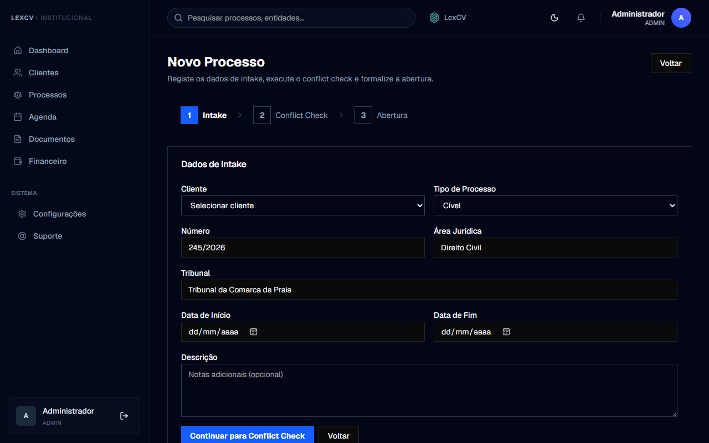

#### Etapa 2 — Conflict Check

1. Clique em **Executar Conflict Check** para verificar conflitos de interesse.
2. Analise os resultados (SEM CONFLITO, Potencial, Sanável ou Impeditivo).
3. Um utilizador com perfil de Gestão seleciona o **Nível Final**, escreve a **Justificativa** e clica em **Registar Decisão**.
4. Se o nível não for Impeditivo, clique em **Continuar para Abertura**.

#### Etapa 3 — Revisão e Abertura

1. Reveja o resumo dos dados inseridos.
2. Clique em **Formalizar Processo** para oficializar a abertura do caso.

---

### Guia 3: Enviar um Documento com Nível de Confidencialidade

1. No menu lateral, clique em **Documentos** e depois em **Upload** (canto superior direito).

   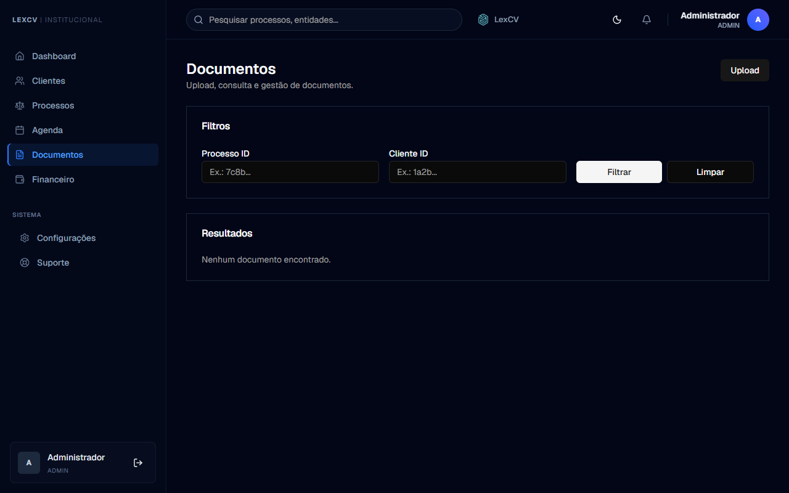

2. Arraste e largue o ficheiro na caixa ou clique para selecionar (PDF, imagem, Word ou texto).
3. Preencha os campos:
   * **Nome** (ex.: `Procuração Assinada`), **Tipo** (ex.: `Contrato`).
   * **Processo ID** / **Cliente ID** — para associar o documento.
4. No campo **Confidencialidade**, selecione o nível adequado:
   * **Público** → visível por todos.
   * **Interno** → apenas equipa interna.
   * **Confidencial** → apenas advogados e administradores.
   * **Restrito** → apenas pessoal especificamente autorizado.
5. (Opcional) Para atualizar uma versão existente, coloque o UUID do documento original no campo **ID a substituir**.
6. Clique em **Enviar**.

   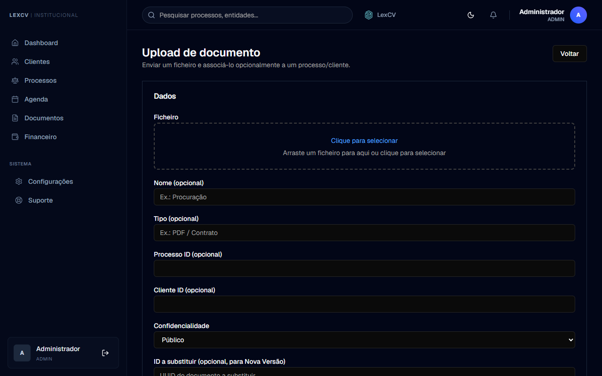

---

### Guia 4: Criar um Honorário Financeiro

1. No menu lateral, clique em **Financeiro** e depois em **Novo honorário**.

   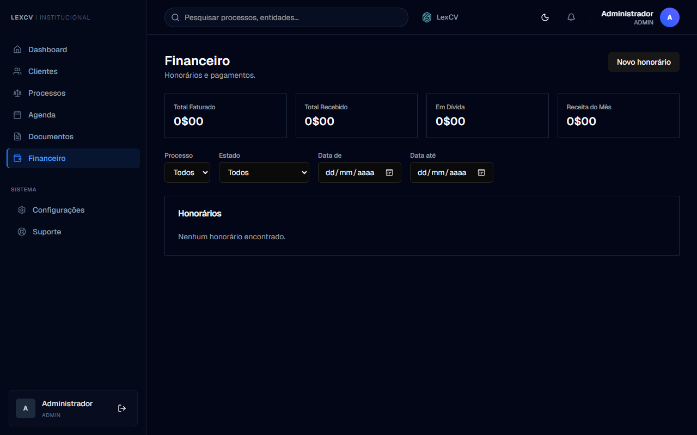

2. Preencha o formulário:
   * **Processo** — selecione o processo na lista suspensa.
   * **Valor total** — ex.: `150000.00`.
   * **Data do acordo** (opcional) — data em que os valores foram acordados.
   * **Descrição** (opcional) — ex.: `Honorário referente à fase de julgamento`.
3. Clique em **Criar**.

   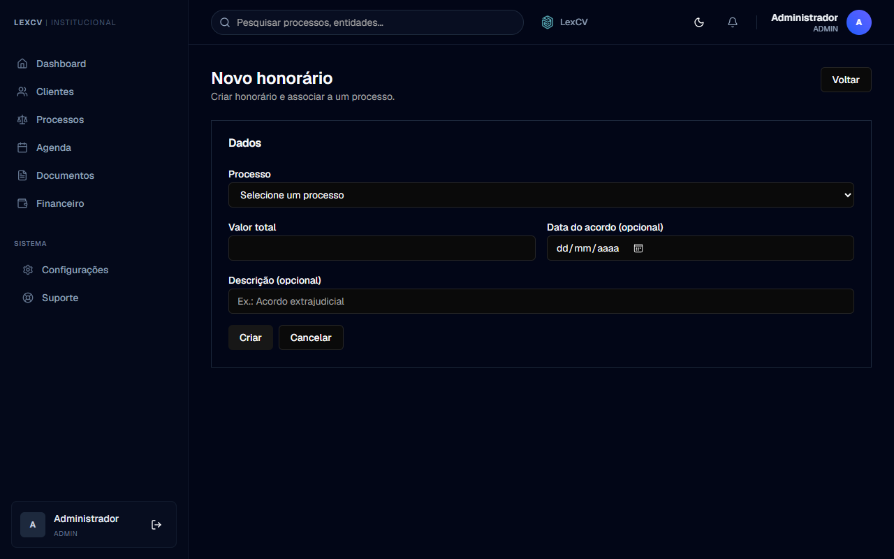

---

### Guia 5: Configurar Permissões de Acesso (RBAC)

1. No menu lateral, clique em **Configurações**.
2. Clique no separador **RBAC**.
3. Visualize a **Matriz de Permissões** — uma grelha que cruza os papéis (**ADMIN, ADVOGADO, TECNICO, ASSISTENTE**) com as ações de cada módulo.
4. Clique nas caixas de seleção para ativar ou desativar permissões.

   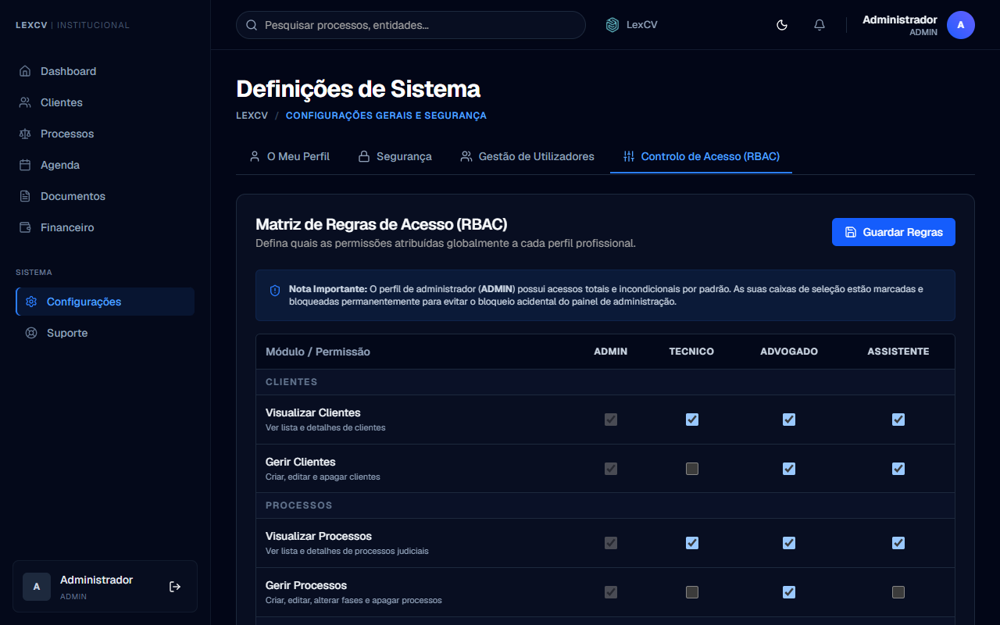

---

## 4. Resolução de Problemas Comuns (FAQ)

### 1. Não consigo avançar para a Etapa 3 ao criar um processo. Porquê?

Existem dois motivos:
* **Falta de decisão registada:** Na Etapa 2 é obrigatório que um gestor registe a decisão sobre o conflito clicando em **Registar Decisão**.
* **Conflito Impeditivo:** Se o nível registado for "Impeditivo", o sistema bloqueia a formalização. Contacte o Administrador para rever o caso.

### 2. Aparece "Não tem permissão para..." ao tentar criar um registo. O que fazer?

A sua conta não tem as permissões necessárias para essa ação. Contacte o Administrador do sistema e peça que o seu papel seja atualizado na secção **Configurações → RBAC**.

### 3. Como carregar uma nova versão de um documento sem criar um duplicado?

1. Localize o documento existente em **Documentos** e copie o seu **ID** (UUID).
2. Clique em **Upload** e selecione o novo ficheiro.
3. Cole o ID copiado no campo **ID a substituir (Nova Versão)**.
4. Clique em **Enviar**. O sistema substituirá a versão anterior preservando o historial.

### 4. Introduzi o NIF no campo de documento, mas não atualizou o campo principal de NIF. Porquê?

Quando o **Tipo de Documento** é definido como **NIF**, o sistema sincroniza automaticamente o campo de NIF principal com o número introduzido. Certifique-se de que selecionou corretamente "NIF" na lista suspensa. Se o problema persistir, atualize a página (tecla **F5**).