# Manual do Utilizador — Plataforma Jurídica LexCV
> **Versão:** 1.0 (Edição Oficial)  
> **Sistema:** LexCV — Legal Practice Management Platform (Cabo Verde)  
> **Ambiente:** [https://www.alcv.tech](https://www.alcv.tech)  
> **Data de Atualização:** Setembro de 2026  
> **Público-alvo:** Administradores, Advogados, Técnicos Jurídicos e Assistentes Forenses  

---

## Índice Geral
1. [Visão Geral e Enquadramento do Sistema](#1-visão-geral-e-enquadramento-do-sistema)
2. [Acesso, Autenticação e Segurança](#2-acesso-autenticação-e-segurança)
3. [Perfis de Utilizador e Matriz de Permissões (RBAC)](#3-perfis-de-utilizador-e-matriz-de-permissões-rbac)
4. [Dashboard Institucional e Monitor Executivo](#4-dashboard-institucional-e-monitor-executivo)
5. [Módulo de Gestão de Clientes](#5-módulo-de-gestão-de-clientes)
    - 5.1 [Listagem e Filtros de Clientes](#51-listagem-e-filtros-de-clientes)
    - 5.2 [Registo de Novo Cliente](#52-registo-de-novo-cliente)
    - 5.3 [Ficha do Cliente e Dossiê para Impressão](#53-ficha-do-cliente-e-dossiê-para-impressão)
    - 5.4 [Unificação de Registos Duplicados (Merge de Clientes)](#54-unificação-de-registos-duplicados-merge-de-clientes)
6. [Módulo de Gestão de Processos Judiciais](#6-módulo-de-gestão-de-processos-judiciais)
    - 6.1 [Listagem de Processos](#61-listagem-de-processos)
    - 6.2 [Abertura de Processo com Wizard em 3 Etapas e Conflict Check](#62-abertura-de-processo-com-wizard-em-3-etapas-e-conflict-check)
    - 6.3 [Estrutura do Processo: Os 8 Separadores Operacionais](#63-estrutura-do-processo-os-8-separadores-operacionais)
        - Timeline Unificada
        - Gestão de Partes e Mandatários
        - Tramitação e Fases Processuais
        - Decisões Judiciais e Upload de Sentenças
        - Factos Provados e Cronologia
        - Rol de Testemunhas
        - Peças e Documentos Vinculados
        - Trilha de Auditoria (Audit Log)
    - 6.4 [Geração e Requisitos do Termo de Honorários](#64-geração-e-requisitos-do-termo-de-honorários)
    - 6.5 [Dashboard Operacional e Executivo de Processos](#65-dashboard-operacional-e-executivo-de-processos)
7. [Módulo de Agenda Forense e Gestão de Prazos](#7-módulo-de-agenda-forense-e-gestão-de-prazos)
    - 7.1 [Visão Mensal e Código de Cores](#71-visão-mensal-e-código-de-cores)
    - 7.2 [Marcação de Novo Evento](#72-marcação-de-novo-evento)
8. [Módulo de Gestão Documental (MinIO / S3)](#8-módulo-de-gestão-documental-minio--s3)
9. [Módulo Financeiro, Honorários e Conta-Corrente](#9-módulo-financeiro-honorários-e-conta-corrente)
10. [Módulo de Pareceres Jurídicos e Consultoria](#10-módulo-de-pareceres-jurídicos-e-consultoria)
11. [Central de Notificações e Alertas](#11-central-de-notificações-e-alertas)
12. [Definições de Sistema, Perfil e Administração](#12-definições-de-sistema-perfil-e-administração)
13. [Cenário Simulado Completo (Contexto Cabo Verde)](#13-cenário-simulado-completo-contexto-cabo-verde)

---

## 1. Visão Geral e Enquadramento do Sistema

O **LexCV** é uma plataforma integrada de gestão forense e prática jurídica desenvolvida especificamente para a realidade de **Cabo Verde**. A plataforma centraliza os fluxos de trabalho essenciais de advogados, sociedades de advogados e gabinetes jurídicos, contemplando a tramitação processual nos tribunais de comarca (Praia, Mindelo, Sal, Santa Catarina, etc.), tribunais de relação e Supremo Tribunal de Justiça.

### Pilares Fundamentais do Sistema:
- **Isolamento Multi-Tenant Estrito:** Cada sociedade ou escritório opera num ambiente com dados, clientes e documentos completamente isolados (partição lógica por `tenant_id`).
- **Segurança de Nível Bancário:** Autenticação por tokens JWT em cookies `httpOnly` com proteção `SameSite=Lax`, prevenindo ataques de XSS e extração de credenciais via JavaScript.
- **Armazenamento Documental Conforme:** Ficheiros e peças processuais são guardados no serviço de objetos MinIO (S3-compatible) com acesso exclusivamente por URLs pré-assinados temporários (TTL).
- **Adequação ao Direito Cabo-Verdiano:** Terminologia, fluxos de prazos, estrutura de comarcas, identificação fiscal (NIF de 9 dígitos), CNI/BI e moeda nacional em Escudos Cabo-Verdianos (**CVE**, símbolo **$**).

---

## 2. Acesso, Autenticação e Segurança

### 2.1 Como Aceder à Plataforma
1. Abra o seu navegador web (Google Chrome, Microsoft Edge, Mozilla Firefox ou Safari).
2. Introduza o endereço: `https://www.alcv.tech` (ou o subdomínio atribuído ao seu escritório).
3. O sistema apresentará o ecrã inicial de autenticação institucional.

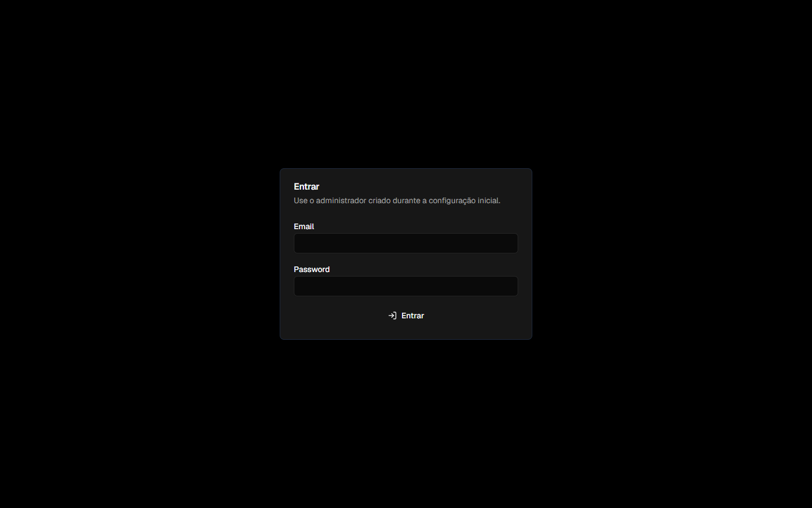

### 2.2 Credenciais de Acesso
* **Utilizador (Email):** Endereço de correio eletrónico profissional registado na plataforma (Ex.: `admin@lexcv.cv` ou `carlos.tavares@lexcv.cv`).
* **Palavra-passe:** Chave de acesso definida no momento do convite ou configuração inicial (Ex.: `Pa$$w0rd`).

> [!IMPORTANT]
> **Políticas de Senha e Boas Práticas:**
> - Nunca partilhe a sua palavra-passe com terceiros nem a guarde em notas desprotegidas.
> - A plataforma bloqueia o acesso após múltiplas tentativas falhadas e regista qualquer anomalia de IP nos logs de auditoria.
> - Recomendamos a alteração periódica da sua senha através do separador **Definições > O Meu Perfil**.

---

## 3. Perfis de Utilizador e Matriz de Permissões (RBAC)

O LexCV baseia-se num modelo robusto de Controlo de Acesso Baseado em Papéis (**Role-Based Access Control - RBAC**), com granularidade por módulo e ação (`scope:action`):

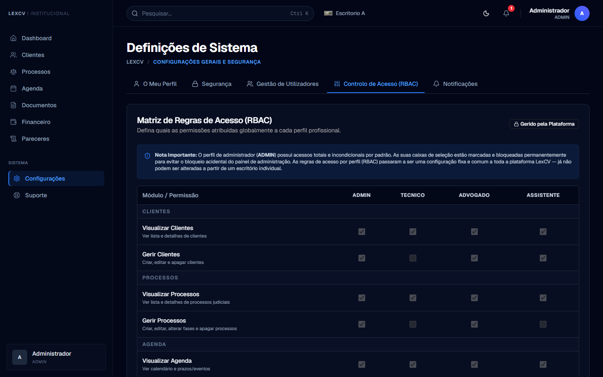

### Papéis Disponíveis e Responsabilidades:

| Papel | Descrição Operacional | Acessos e Competências |
| :--- | :--- | :--- |
| **ADMIN** | Administrador do Escritório | Acesso total e incondicional a todas as opções do sistema, configurações do escritório, gestão de equipa e matriz RBAC. |
| **ADVOGADO** | Advogado Forense / Associado | Gestão de processos, condução de peças, representação em tribunal, marcação de audiências, emissão de pareceres jurídicos e termos de honorários. |
| **TECNICO** | Técnico Jurídico / Solicitador | Consulta de processos, acompanhamento de prazos, registo de diligências na agenda, consulta de documentos e arquivo. |
| **ASSISTENTE** | Secretariado / Apoio Administrativo | Registo inicial de clientes (intake), atendimento, anexação de comprovativos e consulta geral de agenda. |

> [!NOTE]
> Conforme ilustrado na matriz de segurança acima, o perfil **ADMIN** possui permissões totais bloqueadas por padrão para garantir a governança e continuidade operacional do escritório, impedindo bloqueios acidentais.

---

## 4. Dashboard Institucional e Monitor Executivo

Após iniciar sessão com sucesso, o utilizador é recebido no **Dashboard Institucional**, o centro de comando diário com indicadores em tempo real.

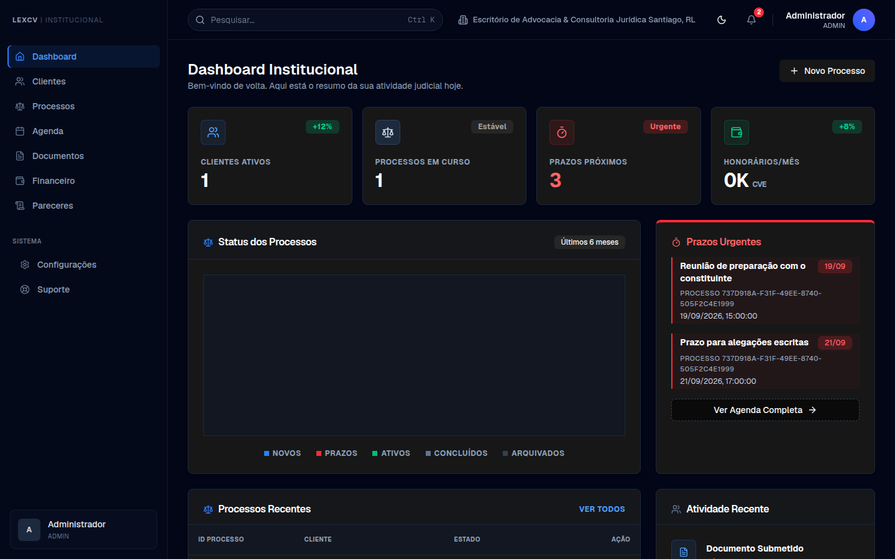

### 4.1 Indicadores-Chave (KPIs Superiores)
1. **Clientes Ativos:** Total de clientes com processos ou serviços vigentes (com percentagem de crescimento mensal).
2. **Processos em Curso:** Volume de ações judiciais e procedimentos extrajudiciais ativos.
3. **Prazos Próximos (Críticos):** Quantidade de prazos perentórios e audiências com vencimento nos próximos 7 dias (destacado a vermelho quando urgente).
4. **Honorários/Mês:** Total faturado e liquidado no mês corrente em Escudos Cabo-Verdianos (**CVE**).

### 4.2 Monitor de Prazos Urgentes e Ações Imediatas
No lado direito do painel, o cartão **Prazos Urgentes** sinaliza em contagem decrescente os atos que exigem intervenção prioritária (ex.: *Audiência de Julgamento* agendada com data e hora exatas), permitindo saltar diretamente para a agenda forense com um clique.

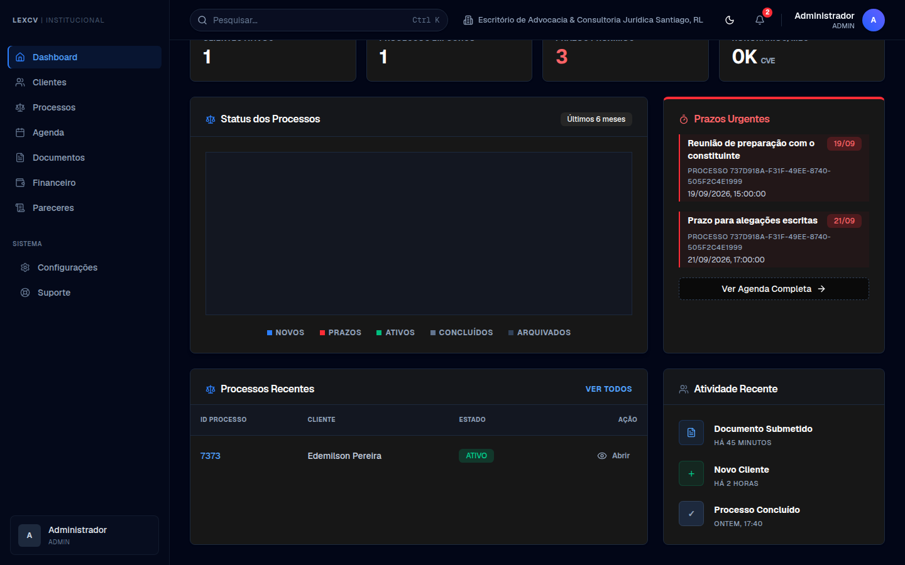

### 4.3 Processos Recentes e Trilha de Atividade
* **Tabela de Processos Recentes:** Exibe os últimos processos movimentados pelo escritório com o respetivo estado (`ATIVO`, `EM TRIAGEM`, `CONCLUÍDO`).
* **Atividade Recente:** Fluxo cronológico com registo de novos documentos submetidos, fases alteradas e eventos concluídos pelos membros da equipa.

---

## 5. Módulo de Gestão de Clientes

O módulo de clientes assegura o ciclo de vida dos constituintes do escritório, suportando tanto pessoas singulares (**Particulares**) como pessoas coletivas (**Empresas**).

### 5.1 Listagem e Filtros de Clientes
Aceda ao menu lateral e clique em **Clientes**.

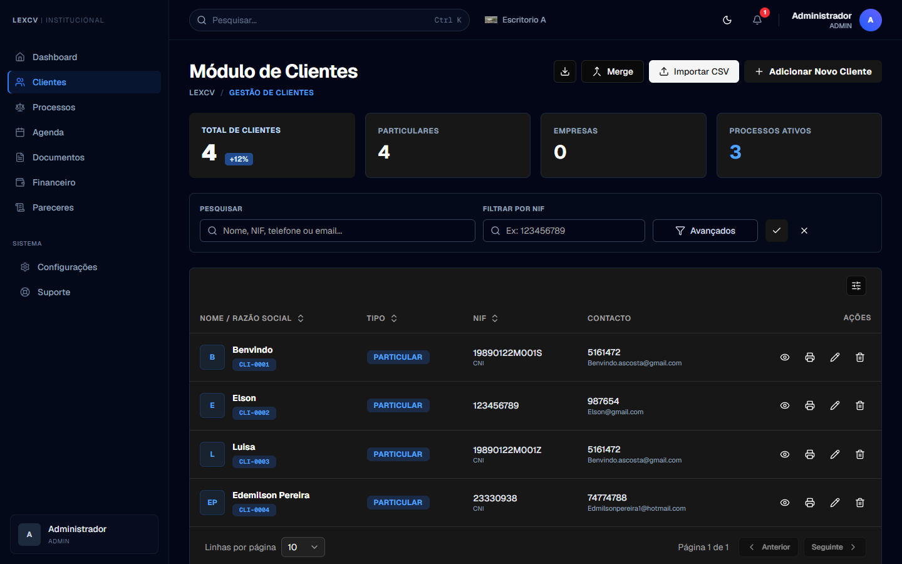

* **Barra de Pesquisa Rápida:** Pesquise por nome, email, telefone ou NIF cabo-verdiano.
* **Filtros Avançados:** Filtre por tipo de cliente, localidade ou ramo de atividade.
* **Ações Rápidas por Linha:**
  - 👁️ **Visualizar Detalhe:** Acesso à página completa do cliente.
  - 🖨️ **Imprimir Ficha:** Emite a ficha cadastral formatada para arquivo físico ou dossiê do cliente.
  - ✏️ **Editar:** Atualização de contactos e morada.
  - 🗑️ **Eliminar:** Remoção (apenas permitida a utilizadores autorizados e sem dependências ativas).

### 5.2 Registo de Novo Cliente
Para registar um constituinte, clique no botão **+ Adicionar Novo Cliente** no topo superior direito.

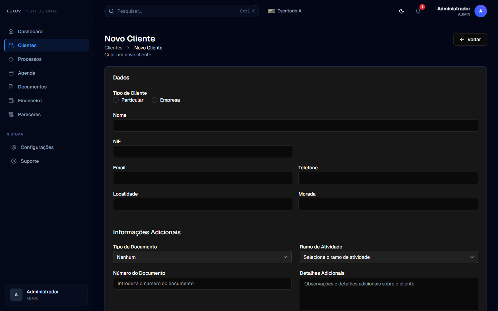

#### Campos de Preenchimento Obrigatórios e Opcionais:
* **Tipo de Cliente:** Selecione `Particular` ou `Empresa`.
* **Nome Completo / Razão Social:** Ex.: *Maria João Gonçalves* ou *Empresa Marítima do Mindelo, SA*.
* **NIF (Número de Identificação Fiscal):** 9 dígitos de acordo com a Direção Nacional de Receitas do Estado (DNRE).
* **Contacto Telefónico e Email:** Para envio automático de notificações e avisos de audiência.
* **Localidade e Morada:** Ilha e concelho (ex.: *Achada Santo António, Praia, Santiago*).
* **Tipo de Documento:** CNI (Cartão Nacional de Identificação), BI, Passaporte ou Certidão de Registo Comercial.
* **Ramo de Atividade & Detalhes Adicionais:** Informações contextuais para apoio ao atendimento.

### 5.3 Ficha do Cliente e Dossiê para Impressão
Ao clicar no ícone de impressão ou aceder ao detalhe do cliente, o LexCV disponibiliza a **Ficha Oficial do Cliente**.

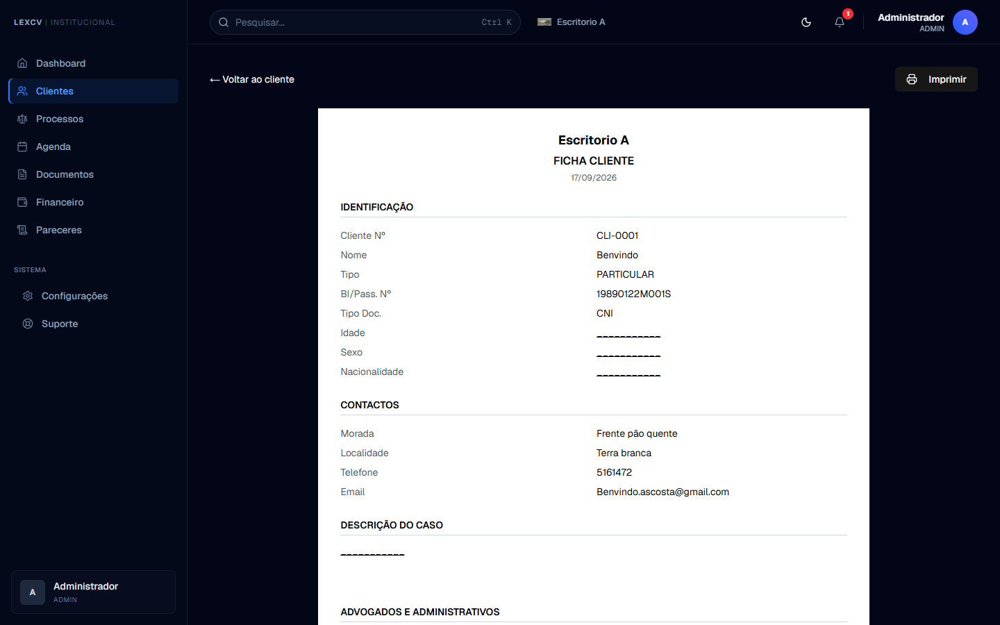

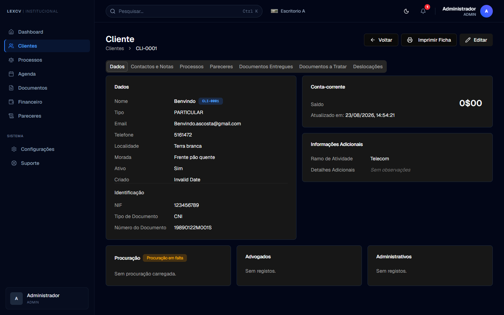

#### Secções da Ficha do Cliente:
1. **Identificação e Contactos:** Dados fiscais e residenciais validados.
2. **Saldo de Conta-Corrente:** Posição financeira em Escudos Cabo-Verdianos (**CVE / $**).
3. **Estado da Procuração Forense:** Alerta visual com indicação clara caso a procuração ainda não tenha sido assinada ou digitalizada (*"Procuração em falta"*).
4. **Advogados e Responsáveis:** Indicação do patrono e da equipa jurídica encarregue do constituinte.

### 5.4 Unificação de Registos Duplicados (Merge de Clientes)
Caso sejam inseridos registos duplicados do mesmo cliente (ex.: criados por assistentes diferentes sob nomes ligeiramente distintos), a ferramenta **Merge de Clientes** permite consolidar o histórico com total segurança jurídica.

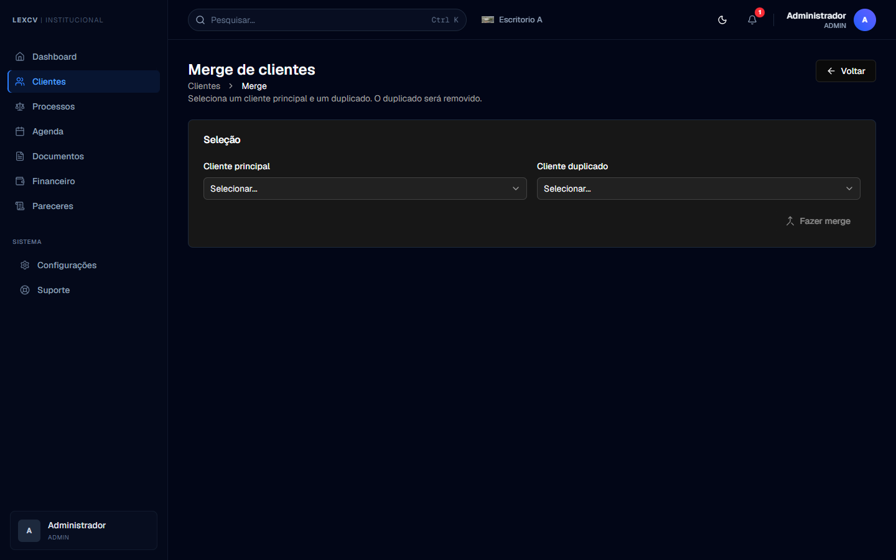

> [!WARNING]
> **Atenção ao Efetuar o Merge:**
> 1. Selecione cuidadosamente o **Cliente Principal** (o registo que manterá os dados de contacto oficiais).
> 2. Selecione o **Cliente Duplicado** (cujos processos, honorários e histórico serão migrados para o principal).
> 3. Após a confirmação, o registo duplicado é removido e todas as referências cruzadas são atualizadas atomicamente na base de dados. Esta operação é irreversível.

---

## 6. Módulo de Gestão de Processos Judiciais

O módulo de processos constitui o coração operacional da plataforma LexCV, refletindo a praxe processual civil, penal e laboral de Cabo Verde.

### 6.1 Listagem de Processos
Aceda ao menu **Processos** para visualizar a carteira forense do escritório.

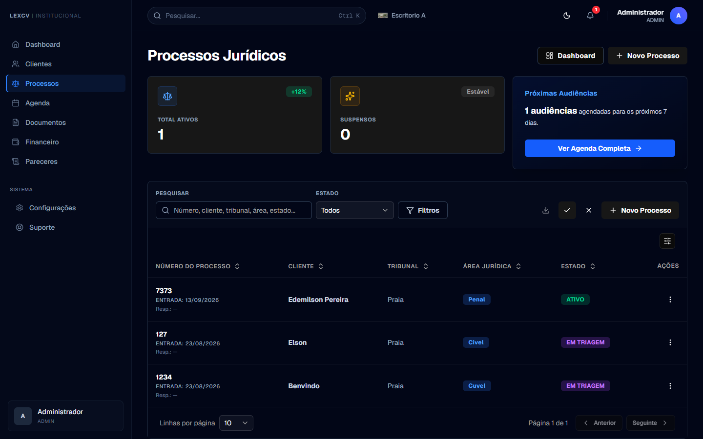

* **Identificação do Processo:** Número judicial atribuído pelo tribunal (ex.: `Proc. 7373`, `Proc. 145/2026`), data de entrada e advogado responsável.
* **Cliente e Tribunal:** Indicação do constituinte e da comarca (ex.: *Tribunal da Comarca da Praia*).
* **Área Jurídica:** Categorização por área de atuação (*Cível*, *Penal*, *Laboral*, *Família*, *Fiscal/Aduaneiro*).
* **Estado:** Badges dinâmicos indicando `ATIVO`, `EM TRIAGEM`, `SUSPENSO` ou `ENCERRADO`.

### 6.2 Abertura de Processo com Wizard em 3 Etapas e Conflict Check
O LexCV implementa um assistente de abertura de processos com verificação prévia obrigatória de conflito de interesses.

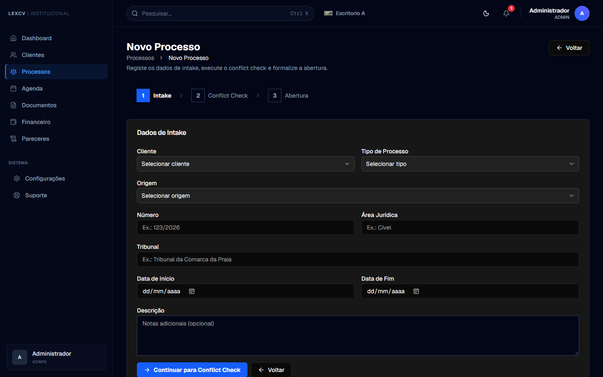

#### Etapa 1: Intake (Recolha de Dados)
- Selecione o **Cliente** constituinte.
- Defina o **Tipo de Processo** e a **Origem** (ex.: *Petição Inicial*, *Notificação Judicial Avulsa*, *Distribuição Externa*).
- Indique o **Tribunal** e **Área Jurídica**.
- Preencha datas de início e descrição sucinta da pretensão jurídica.

#### Etapa 2: Conflict Check (Verificação Deontológica de Conflito de Interesses)
O sistema analisa automaticamente se a parte contrária ou intervenientes já constam como clientes do escritório ou em processos com pretensões incompatíveis.
- O decisor qualificado (Advogado ou Administrador) avalia o resultado e emite a decisão: `SEM CONFLITO`, `COM CONFLITO SANÁVEL` ou `IMPEDITIVO`.
- **Regra de Negócio:** Se for assinalado um conflito de nível *Impeditivo*, a formalização do processo é automaticamente bloqueada pelo sistema.

#### Etapa 3: Abertura Formal
Registo concluído e atribuição do número interno de processo com notificação à equipa.

---

### 6.3 Estrutura do Processo: Os 8 Separadores Operacionais
Ao abrir um processo específico, tem acesso a um ambiente de trabalho completo com 8 separadores de controlo:

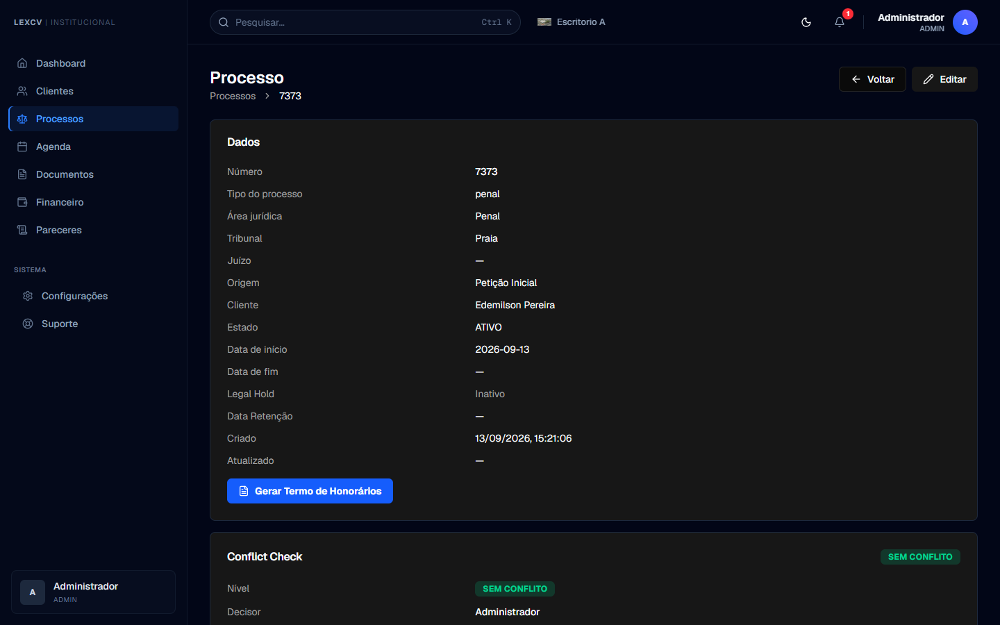

#### 1. Timeline Unificada (`tab=timeline`)
Linha temporal consolidada que reúne todas as movimentações, juntada de documentos, alterações de fase, despachos e audiências num feed cronológico auditável.

#### 2. Gestão de Partes (`tab=partes`)
Registo de todas as partes envolvidas no litígio:
* Autor / Requerente / Demandante
* Réu / Requerido / Demandado
* Terceiros Intervenientes e respetivos Advogados Contrários.

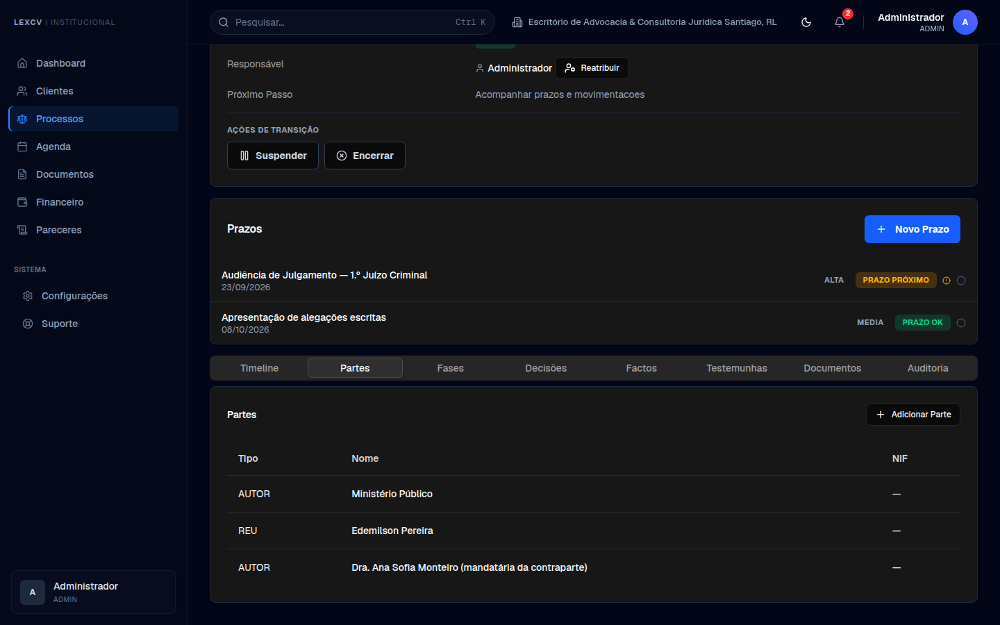

#### 3. Fases Processuais (`tab=fases`)
Acompanhamento do estado do processo ao longo das fases do Código de Processo Civil / Penal:
1. Distribuição
2. Citação / Notificação
3. Articulados (Contestação, Réplica)
4. Audiência Prévia e Saneamento
5. Instrução e Produção de Prova
6. Julgamento
7. Sentença / Decisão Final
8. Recursos

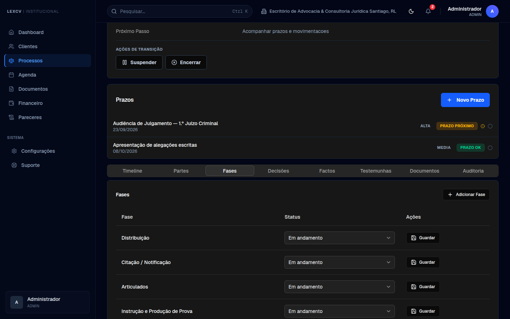

#### 4. Decisões Judiciais (`tab=decisoes`)
Registo formal de despachos judiciais, sentenças e acórdãos com anexação direta do ficheiro digitalizado em formato PDF.

#### 5. Factos Relevantes (`tab=factos`)
Cronologia estruturada dos factos controvertidos e provados, permitindo ao mandatário organizar a argumentação jurídica e a matéria de facto para a audiência de discussão e julgamento.

#### 6. Rol de Testemunhas (`tab=testemunhas`)
Gestão das testemunhas indicadas pelo escritório ou arroladas pela contraparte, com indicação de contactos, morada para notificação e resumo do depoimento prestado.

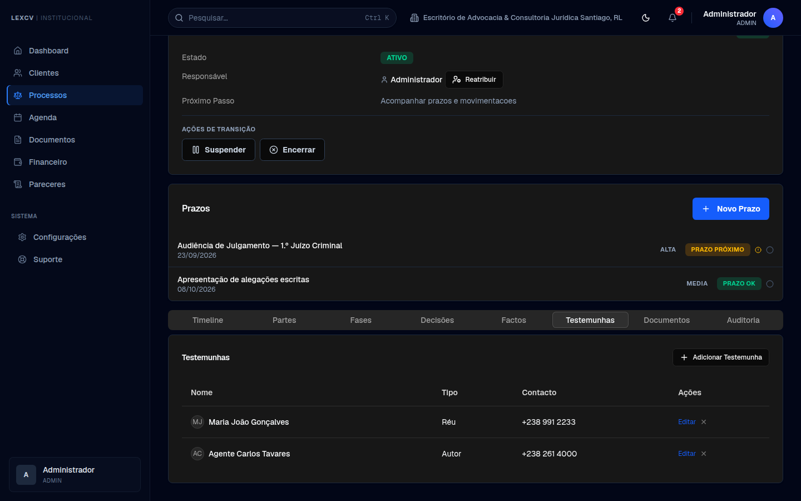

#### 7. Documentos do Processo (`tab=documentos`)
Arquivo digital de peças processuais, procurações com poderes forenses, certidões do registo predial/comercial e comprovativos de pagamento de taxa de justiça.

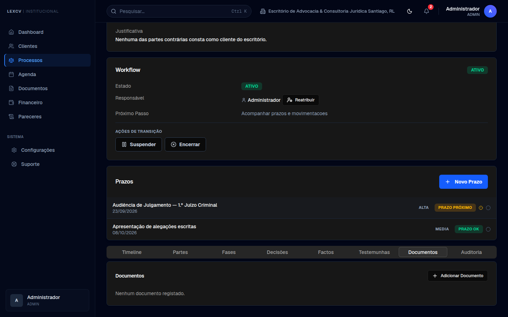

#### 8. Trilha de Auditoria (`tab=auditoria`)
Registo imutável (log) de todas as operações efetuadas no processo (criação, edição de dados, anexação de ficheiros, transições de estado), garantindo transparência e integridade forense.

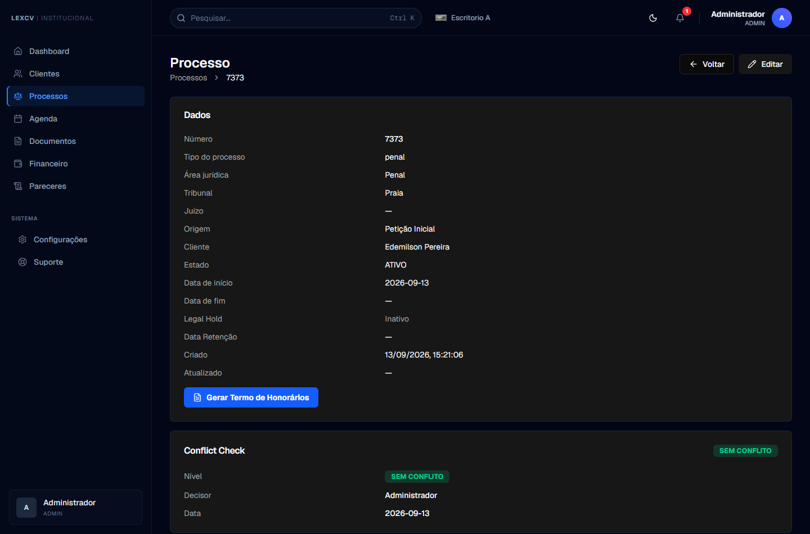

---

### 6.4 Geração e Requisitos do Termo de Honorários
Na barra de ações do processo, o botão **Gerar Termo de Honorários** emite o documento contratual de prestação de serviços jurídicos para assinatura com o constituinte.

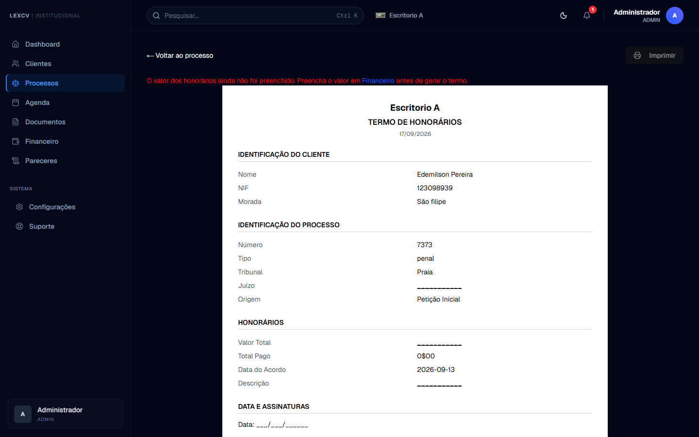

> [!NOTE]
> **Regra de Negócio Mandatória:**
> Se o valor dos honorários acordados ainda não tiver sido lançado no módulo financeiro, o sistema emite um aviso informativo:  
> *"O valor dos honorários ainda não foi preenchido. Preencha o valor em Financeiro antes de gerar o termo."*  
> Isto garante que nenhum documento vinculativo seja impresso sem os valores devidamente acordados.

---

### 6.5 Dashboard Operacional e Executivo de Processos
Aceda a **Processos > Dashboard** para uma análise de produtividade e acompanhamento da carga processual do escritório:

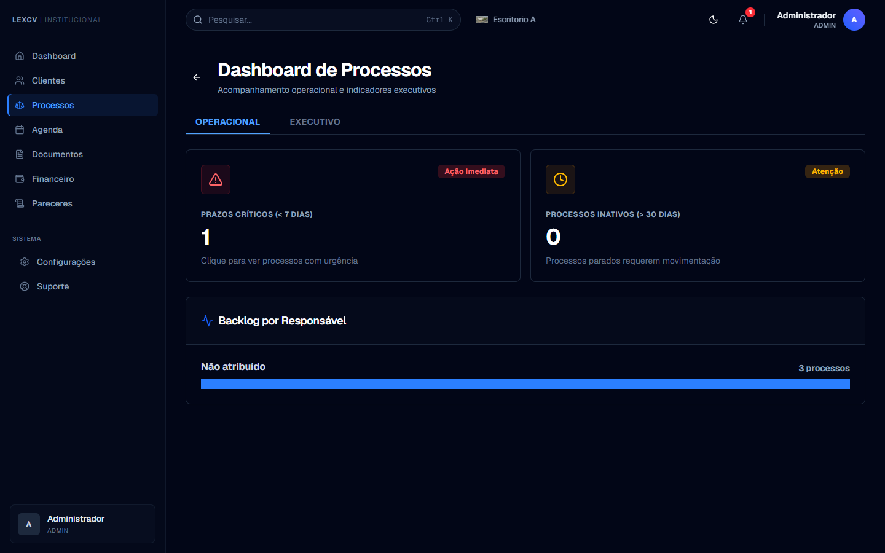

* **Prazos Críticos (< 7 Dias):** Ações com prazos iminentes que necessitam de peça urgente.
* **Processos Inativos (> 30 Dias):** Ações paradas sem movimentação recente que requerem contacto com a secretaria judicial.
* **Backlog por Responsável:** Distribuição da carga de trabalho entre os advogados e associados do escritório.

---

## 7. Módulo de Agenda Forense e Gestão de Prazos

A agenda do LexCV foi concebida para mitigar o principal risco de qualquer prática forense: a perda de prazos judiciais perentórios.

### 7.1 Visão Mensal e Código de Cores
Aceda ao menu **Agenda**.

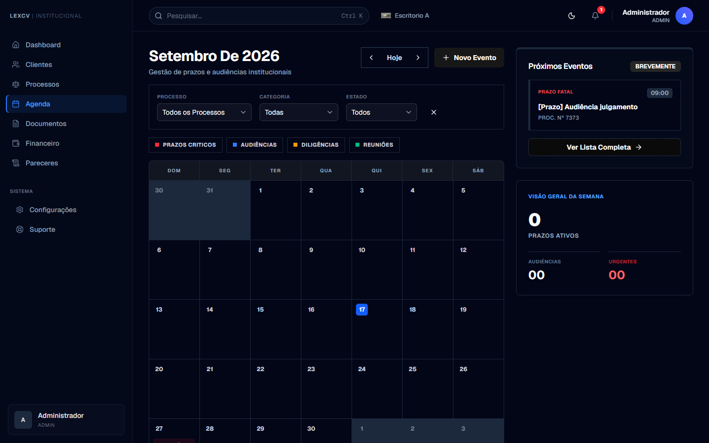

#### Categorização Visual dos Eventos:
- 🔴 **Prazos Críticos / Fatais:** Prazos para contestações, recursos, alegações ou pagamento de custas.
- 🔵 **Audiências:** Julgamentos, inquirições de testemunhas, tentativas de conciliação.
- 🟠 **Diligências:** Deslocações a conservatórias, cartórios, ministério público ou esquadras da Polícia Nacional.
- 🟢 **Reuniões:** Consultas jurídicas presenciais ou virtuais com clientes.

### 7.2 Marcação de Novo Evento
Clique em **+ Novo Evento** para abrir o formulário de agendamento.

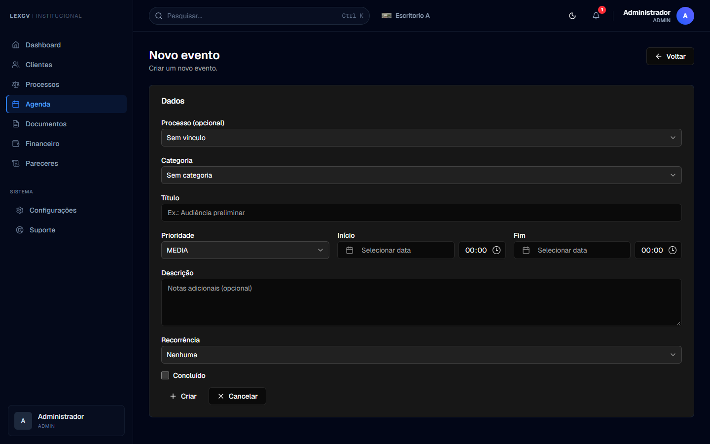

* **Vinculação a Processo:** Associe o evento ao respetivo número judicial para que este apareça automaticamente na timeline do processo.
* **Prioridade:** Defina como `BAIXA`, `MÉDIA` ou `ALTA`.
* **Data e Hora de Início e Fim:** Registo temporal com notificações automáticas.
* **Recorrência:** Para reuniões de acompanhamento ou avenças com periodicidade fixa.

---

## 8. Módulo de Gestão Documental (MinIO / S3)

O módulo de documentos oferece um arquivo eletrónico seguro e centralizado para todas as peças forenses.

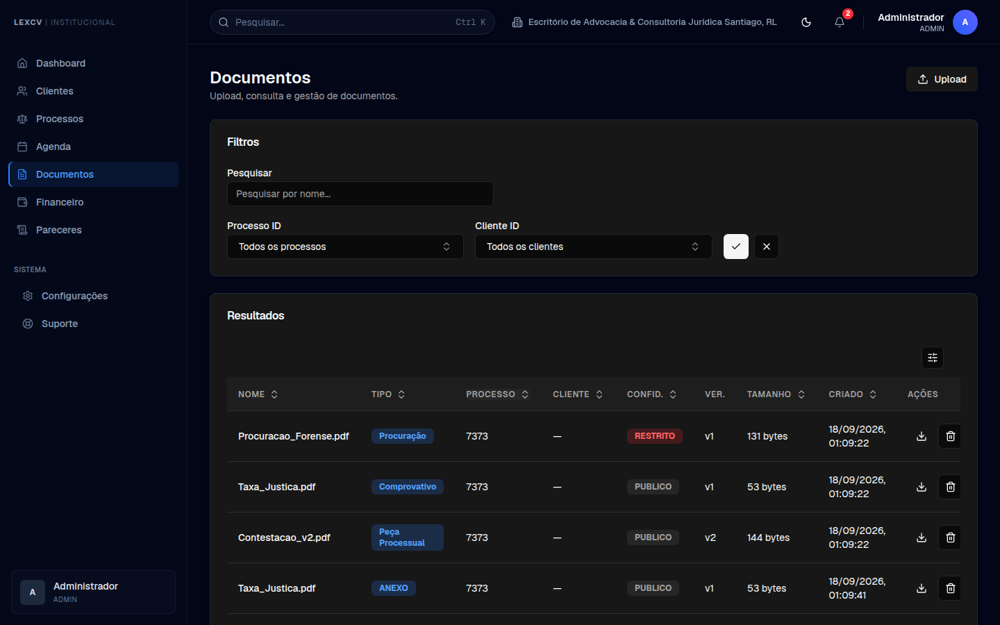

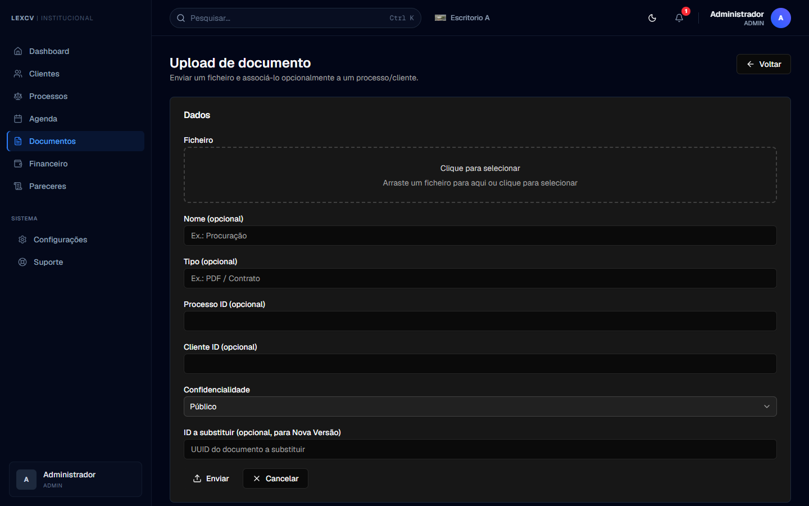

### Características de Destaque:
1. **Upload com Arrastar e Largar (Drag & Drop):** Envie ficheiros PDF, Word ou imagens com facilidade.
2. **Classificação de Confidencialidade:** Marque o ficheiro como `Público` (visível a toda a equipa) ou `Restrito`.
3. **Versionamento Seguro de Peças:** O campo *"ID a substituir (opcional, para Nova Versão)"* permite enviar uma versão corrigida de um articulado sem apagar o histórico da versão anterior.
4. **Armazenamento Seguro em Objeto (MinIO):** Os ficheiros nunca são gravados no disco do servidor web, sendo gerados URLs temporários com expiração automática para download.

---

## 9. Módulo Financeiro, Honorários e Conta-Corrente

O módulo financeiro assegura a gestão de cobranças, acordos de honorários e liquidações do escritório na moeda nacional de Cabo Verde (**Escudos — CVE / $**).

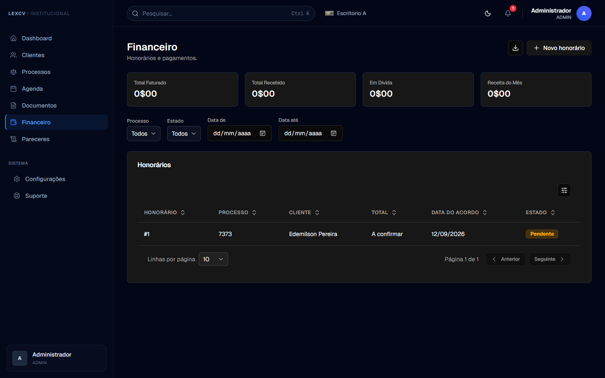

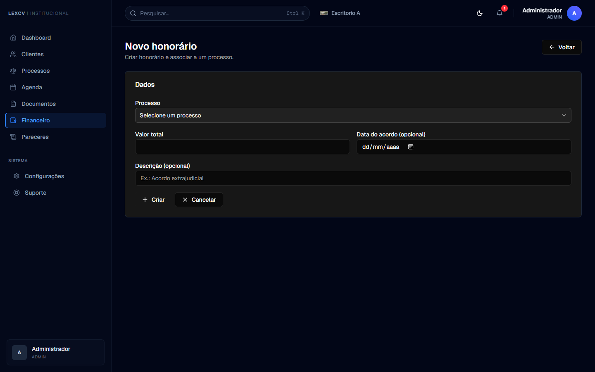

### Painel de Resumo Financeiro:
* **Total Faturado:** Volume global de honorários contratualizados.
* **Total Recebido:** Montante já liquidado pelos clientes em dinheiro ou transferência bancária (ex.: Vinti4 / BCA / BCN).
* **Em Dívida:** Saldo devedor pendente de regularização.
* **Receita do Mês:** Faturação e recebimentos no período de referência.

### Lançamento de Acordo de Honorários:
1. Aceda a **Financeiro > + Novo Honorário**.
2. Selecione o **Processo** correspondente.
3. Preencha o **Valor Total** (ex.: `250.000$00 CVE`).
4. Indique a **Data do Acordo** e eventuais condições de parcelamento no campo de descrição (ex.: *"50% na entrada da petição, 50% na data da audiência de julgamento"*).

---

## 10. Módulo de Pareceres Jurídicos e Consultoria

Para os escritórios que prestam serviços de consultoria jurídica continuada, o LexCV disponibiliza um fluxo dedicado à emissão de pareceres jurídicos formais.

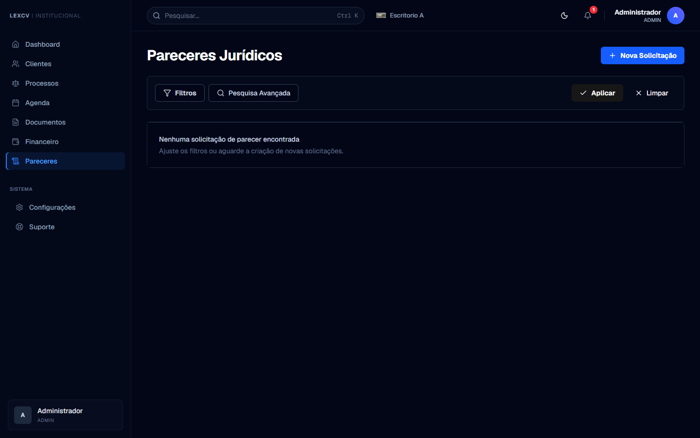

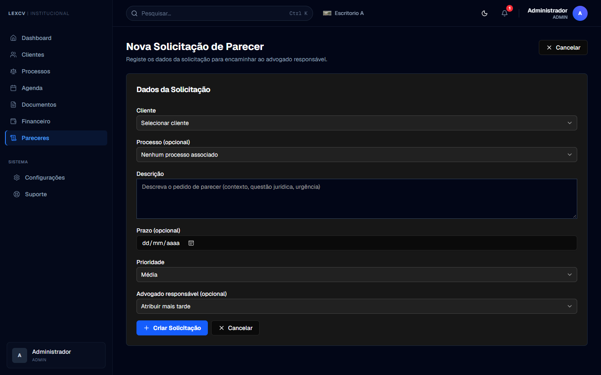

### Fluxo de Trabalho do Parecer:
1. **Entrada do Pedido:** O assistente ou advogado regista a solicitação, indicando o cliente, a questão jurídica e o prazo pretendido.
2. **Atribuição:** Indicação do Advogado especialista responsável pela pesquisa jurisprudencial e redação.
3. **Elaboração & Revisão:** Redação dos fundamentos jurídicos, citação de legislação cabo-verdiana e doutrina.
4. **Homologação e Entrega:** Emissão do parecer final e notificação ao cliente.

---

## 11. Central de Notificações e Alertas

A central de notificações do LexCV assegura que nenhum membro do escritório perca eventos críticos ou alterações efetuadas nos processos.

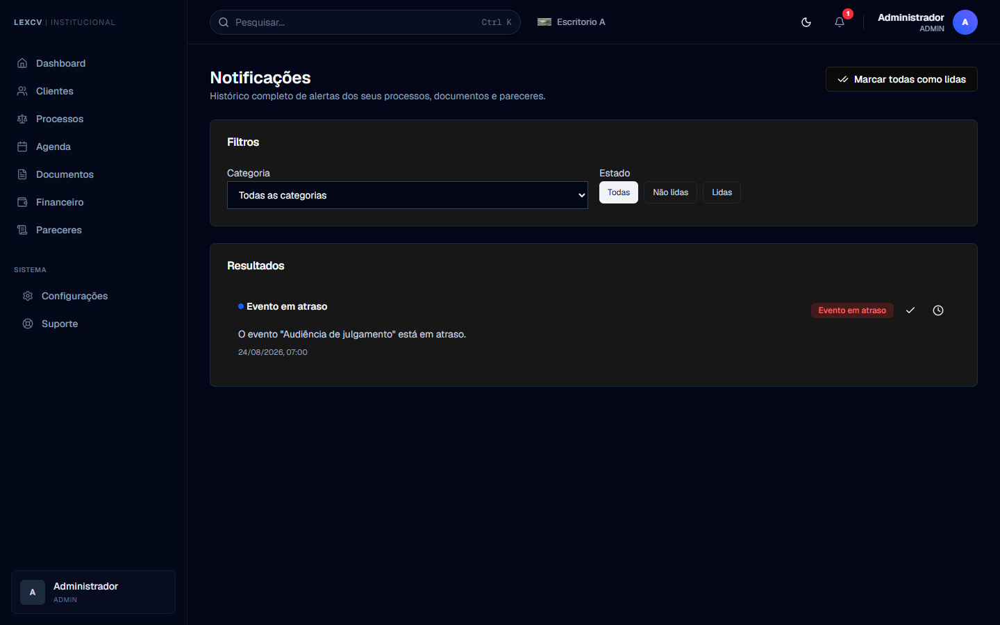

* **Alertas de Evento em Atraso:** Destacados com aviso visual a vermelho para intervenção imediata.
* **Filtros por Estado:** Separação intuitiva entre notificações `Não Lidas` e `Lidas`.
* **Ação em Lote:** Botão **"Marcar todas como lidas"** para limpeza do painel após conferência.

---

## 12. Definições de Sistema, Perfil e Administração

As configurações do sistema permitem personalizar os parâmetros do utilizador e administrar a equipa do escritório.

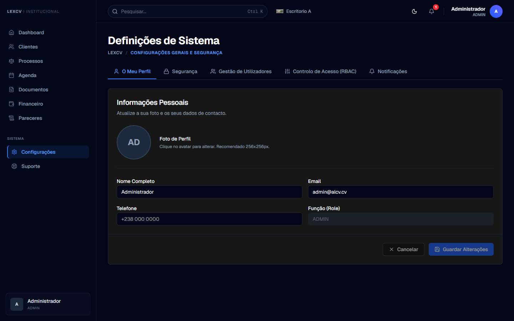

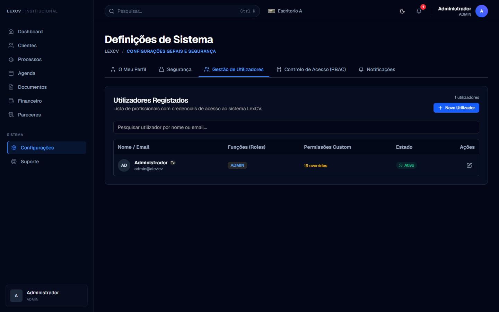

### Funcionalidades de Gestão:
* **O Meu Perfil:** Atualização de nome, email de notificações, telefone e fotografia de perfil.
* **Segurança:** Alteração da palavra-passe com exigência de padrões seguros.
* **Gestão de Utilizadores:** Criação de novos utilizadores com o botão **+ Novo Utilizador**, definição de papéis e estado de atividade (`Ativo` / `Inativo`).
* **Controlo de Acesso (RBAC):** Consulta da matriz global de direitos para conferência de auditoria interna.

---

## 13. Cenário Simulado Completo (Contexto Cabo Verde)

Para efeitos de formação e demonstração prática, considere o seguinte caso prático realista baseado nos dados da plataforma:

### Dados da Sociedade / Escritório
* **Denominação:** *Escritório de Advocacia & Consultoria Jurídica Santiago, RL*
* **Sede:** Av. Cidade de Lisboa, Fazenda, Praia — Ilha de Santiago, Cabo Verde
* **NIF:** 254.896.321 | **Telefone:** +238 261 4000

### Ficha de Cliente Simulado
* **Cliente:** *Edemilson Pereira* (Código: `CLI-0004`)
* **NIF:** 23330938 | **Documento:** CNI nº 19890122M001Z
* **Morada:** São Filipe, Praia, Ilha de Santiago
* **Contacto:** +238 74774788 | Email: edemilsonpereira1@hotmail.com

### Processo Judicial Simulado
* **Número Judicial:** `7373` (Entrada: 13/09/2026)
* **Tribunal:** Tribunal da Comarca da Praia (1º Juízo Criminal)
* **Natureza:** Processo Penal / Defesa Forense
* **Resultado do Conflict Check:** `SEM CONFLITO` (Homologado pelo Administrador)
* **Honorário Acordado:** 180.000$00 CVE (com Termo de Honorários associado)
* **Próxima Audiência:** Audiência de Julgamento agendada com notificação de prazo fatal ativa na agenda forense.

---
© 2026 LexCV. Todos os direitos reservados.
